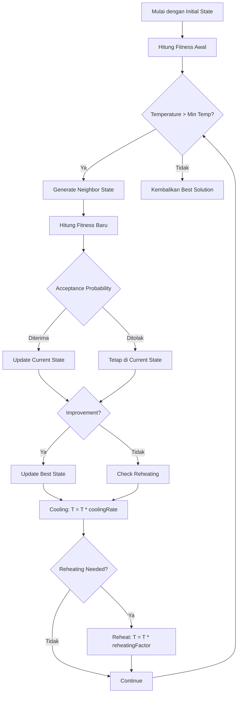

# Arsitektur dan Algoritma Core Package Timetable-SA

## 1. Overview Arsitektur

Timetable-SA adalah library optimasi generik yang menggunakan algoritma **Simulated Annealing** untuk menyelesaikan masalah *constraint satisfaction* seperti penjadwalan, alokasi sumber daya, dan masalah optimasi lainnya.

### 1.1 Komponen Utama Arsitektur

```
┌─────────────────────────────────────────────────────────────┐
│                    TIMETABLE-SA CORE                        │
├─────────────────────────────────────────────────────────────┤
│  ┌─────────────────┐  ┌─────────────────┐  ┌──────────────┐ │
│  │ SimulatedAnnealing│  │   Constraint   │  │ MoveGenerator│ │
│  │     Algorithm    │  │   Interface    │  │  Interface   │ │
│  └─────────────────┘  └─────────────────┘  └──────────────┘ │
├─────────────────────────────────────────────────────────────┤
│  ┌─────────────────┐  ┌─────────────────┐  ┌──────────────┐ │
│  │   SAConfig      │  │    Solution     │  │   Violation  │ │
│  │   Interface     │  │     Type        │  │     Type     │ │
│  └─────────────────┘  └─────────────────┘  └──────────────┘ │
└─────────────────────────────────────────────────────────────┘
```

### 1.2 Flow Arsitektur

1. **Input**: State awal + Constraints + Move Generators + Konfigurasi
2. **Process**: Algoritma Simulated Annealing dengan 2 fase
3. **Output**: Solusi optimal dengan statistik lengkap

## 2. Algoritma Simulated Annealing

### 2.1 Konsep Dasar Simulated Annealing

Simulated Annealing adalah algoritma optimasi metaheuristik yang terinspirasi dari proses annealing dalam metalurgi. Algoritma ini menggunakan konsep "temperature" untuk mengontrol probabilitas menerima solusi yang lebih buruk dalam rangka menghindari *local minima*.

### 2.2 Dua Fase Optimasi

Timetable-SA mengimplementasikan algoritma **2-fase**:

#### Fase 1: Eliminasi Hard Constraint Violations (60% iterasi)
- **Tujuan**: Menghilangkan semua pelanggaran hard constraints
- **Strategi**: Fokus pada penyelesaian konflik fundamental
- **Acceptance**: Prioritaskan pengurangan hard violations

#### Fase 2: Optimasi Soft Constraints (40% iterasi)
- **Tujuan**: Mengoptimalkan preferensi sambil mempertahankan hard constraints
- **Strategi**: Meningkatkan kualitas solusi
- **Acceptance**: TIDAK PERNAH menerima solusi yang menambah hard violations

### 2.3 Alur Algoritma Detail



## 3. Komponen Core Package

### 3.1 SimulatedAnnealing Class

Kelas utama yang mengimplementasikan algoritma optimasi:

```typescript
class SimulatedAnnealing<TState> {
  constructor(
    initialState: TState,
    constraints: Constraint<TState>[],
    moveGenerators: MoveGenerator<TState>[],
    config: SAConfig<TState>
  )
  
  solve(): Solution<TState>
}
```

**Fitur Utama:**
- **Adaptive Operator Selection**: Memilih move generator berdasarkan success rate
- **Reheating Mechanism**: Meningkatkan temperature untuk escape local minima
- **Comprehensive Logging**: Detail statistik dan progress tracking
- **Two-Phase Optimization**: Fase hard constraints dan soft constraints

### 3.2 Constraint Interface

Interface untuk mendefinisikan constraints:

```typescript
interface Constraint<TState> {
  name: string;
  type: 'hard' | 'soft';
  weight?: number;  // untuk soft constraints
  
  evaluate(state: TState): number;  // 0-1 score
  describe?(state: TState): string | undefined;
  getViolations?(state: TState): string[];
}
```

**Jenis Constraints:**
- **Hard Constraints**: WAJIB dipenuhi (penalty sangat tinggi)
- **Soft Constraints**: Preferensi (penalty ringan dengan weight)

### 3.3 MoveGenerator Interface

Interface untuk mendefinisikan move operators:

```typescript
interface MoveGenerator<TState> {
  name: string;
  
  generate(state: TState, temperature: number): TState;
  canApply(state: TState): boolean;
}
```

**Jenis Move Operators:**
- **Local Moves**: Modifikasi elemen tunggal
- **Swap Moves**: Tukar properti antar elemen
- **Targeted Moves**: Fokus pada perbaikan violation spesifik

### 3.4 SAConfig Interface

Konfigurasi algoritma:

```typescript
interface SAConfig<TState> {
  initialTemperature: number;      // 100-10000
  minTemperature: number;          // 0.001-1
  coolingRate: number;             // 0.95-0.999
  maxIterations: number;           // 10000-100000
  hardConstraintWeight: number;    // 1000-100000
  cloneState: (state: TState) => TState;
  
  reheatingThreshold?: number;     // 1000-5000
  reheatingFactor?: number;        // 1.5-3.0
  maxReheats?: number;             // default: 3
  
  logging?: LoggingConfig;
}
```

## 4. Strategi Optimasi

### 4.1 Adaptive Operator Selection

Algoritma menggunakan strategi seleksi adaptif:
- **30%** random selection (exploration)
- **70%** weighted selection berdasarkan success rate

### 4.2 Temperature-Dependent Moves

Move generators dapat menggunakan temperature untuk menyesuaikan intensitas:
- **High Temperature**: Eksplorasi luas (moves besar dan random)
- **Low Temperature**: Refinemen lokal (moves kecil dan fokus)

### 4.3 Reheating Mechanism

Ketika stuck di local minima:
1. Deteksi: Tidak ada improvement selama N iterasi
2. Action: Naikkan temperature dengan factor reheating
3. Limit: Maksimal M reheating events

## 5. Fitness Calculation

### 5.1 Formula Fitness

```
Fitness = (HardViolations × HardConstraintWeight) + SoftPenalty

Dimana:
HardViolations = Σ(1 - score) untuk setiap hard constraint
SoftPenalty = Σ((1 - score) × weight) untuk setiap soft constraint
```

### 5.2 Scoring System

- **Score = 1.0**: Constraint terpenuhi sempurna
- **Score = 0.0**: Constraint dilanggar total
- **Score 0.0-1.0**: Pemenuhan parsial (untuk soft constraints)

## 6. Solution Structure

### 6.1 Output Interface

```typescript
interface Solution<TState> {
  state: TState;                    // Best state found
  fitness: number;                  // Final fitness score
  hardViolations: number;           // Jumlah hard violations
  softViolations: number;           // Jumlah soft violations
  iterations: number;               // Total iterasi
  reheats: number;                  // Jumlah reheating events
  finalTemperature: number;         // Temperature akhir
  violations: Violation[];          // Detail violations
  operatorStats: OperatorStats;     // Statistik operator
}
```

### 6.2 Violation Reporting

Setiap violation meliputi:
- Nama constraint
- Tipe (hard/soft)
- Score severity
- Deskripsi human-readable

## 7. Best Practices

### 7.1 Parameter Tuning

**Initial Temperature**: 
- Terlalu tinggi → Wasted iterations
- Terlalu rendah → Stuck di local minima

**Cooling Rate**:
- Tinggi (0.999) → Slow cooling, better results
- Rendah (0.95) → Fast cooling, may miss optimum

**Hard Constraint Weight**:
- Jauh lebih besar dari soft weights
- Typical: 1000-100000

### 7.2 Constraint Design

**Hard Constraints**:
- Binary scoring (0 atau 1)
- Fundamental requirements

**Soft Constraints**:
- Gradual scoring (0-1)
- Weighted by importance
- Preferences and optimizations

### 7.3 Move Generator Design

**Targeted Operators**:
- Fokus pada violation types spesifik
- Higher success rate untuk constraint fixing

**General Operators**:
- Untuk eksplorasi dan optimasi
- Temperature-dependent behavior

## 8. Performance Considerations

### 8.1 Computational Complexity

- **Time**: O(iterations × constraints × moves)
- **Space**: O(state size + constraint data)

### 8.2 Optimization Strategies

1. **Efficient State Cloning**: Custom clone functions
2. **Smart Move Selection**: Adaptive operator selection
3. **Early Termination**: Stop jika perfect solution found
4. **Parallel Evaluation**: Untuk constraints yang independent

## 9. Extensibility

### 9.1 Domain-Specific Implementation

Library ini dirancang untuk:
- **Generic**: Bisa untuk berbagai domain problems
- **Unopinionated**: Tidak memaksakan struktur spesifik
- **Extensible**: Mudah ditambahkan constraints dan moves

### 9.2 Custom Domain Types

Users dapat mendefinisikan:
- Custom state types
- Domain-specific constraints
- Specialized move operators
- Custom evaluation functions

## 10. Integration Patterns

### 10.1 Basic Integration

```typescript
const solver = new SimulatedAnnealing(
  initialState,
  constraints,
  moveGenerators,
  config
);

const solution = solver.solve();
```

### 10.2 Advanced Integration

- Custom logging dan monitoring
- Dynamic constraint adjustment
- Multi-objective optimization
- Hybrid algorithms