# Visualisasi dan Diagram Alur

## 1. Overview Arsitektur Sistem

### 1.1 High-Level Architecture

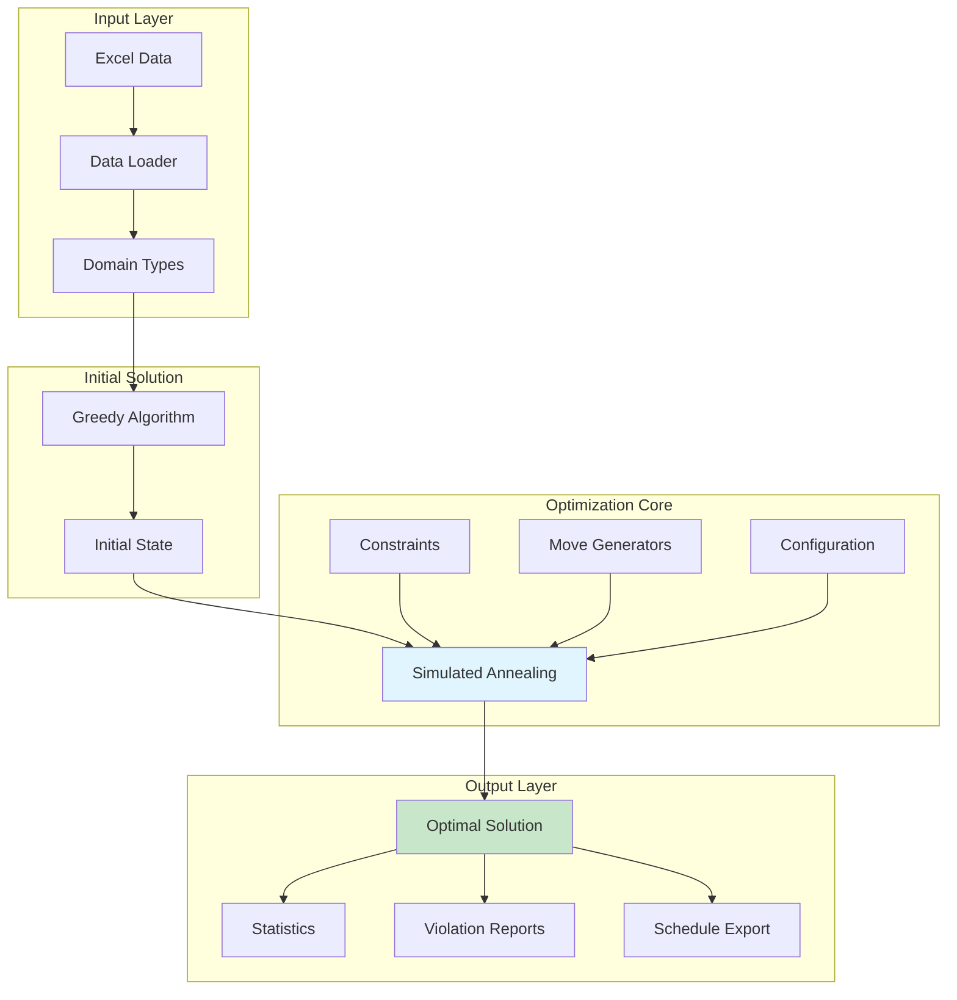

### 1.2 Component Interaction

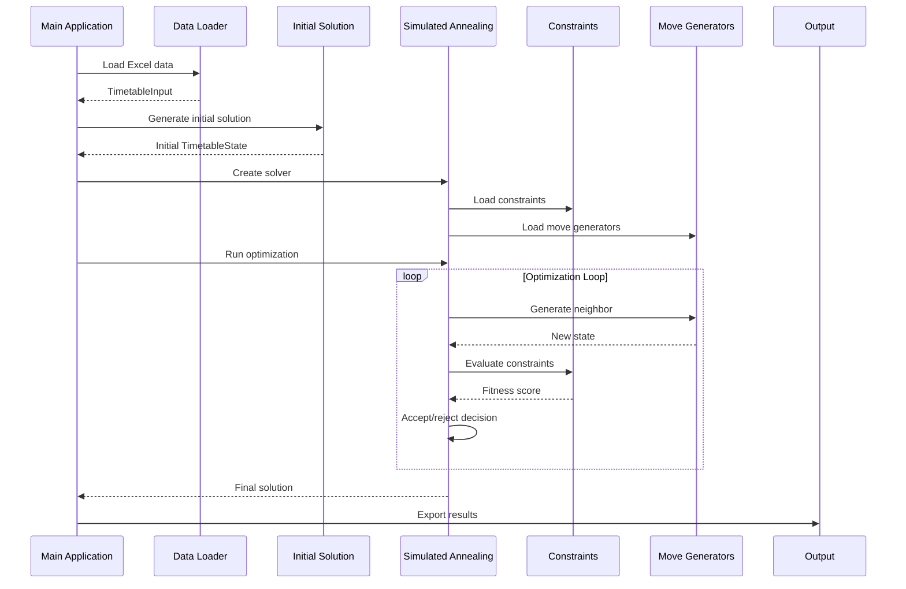

## 2. Algoritma Simulated Annealing

### 2.1 Two-Phase Optimization Flow

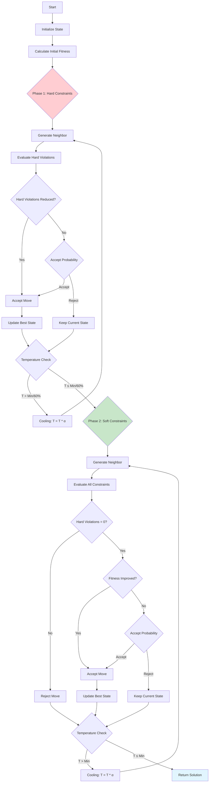

### 2.2 Temperature Schedule Visualization

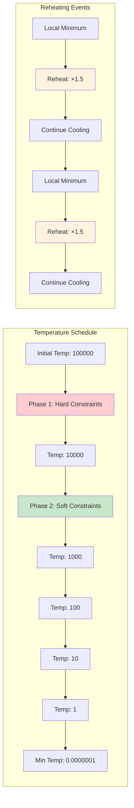

## 3. Constraint System

### 3.1 Constraint Hierarchy

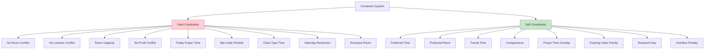

### 3.2 Constraint Evaluation Flow

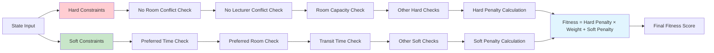

## 4. Move Generator System

### 4.1 Move Generator Categories

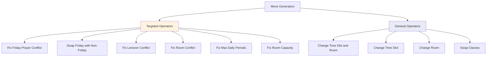

### 4.2 Adaptive Operator Selection

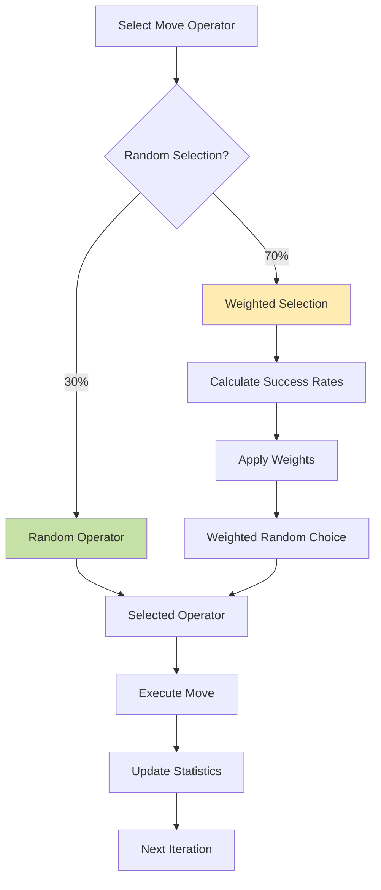

## 5. Data Flow and State Management

### 5.1 State Evolution

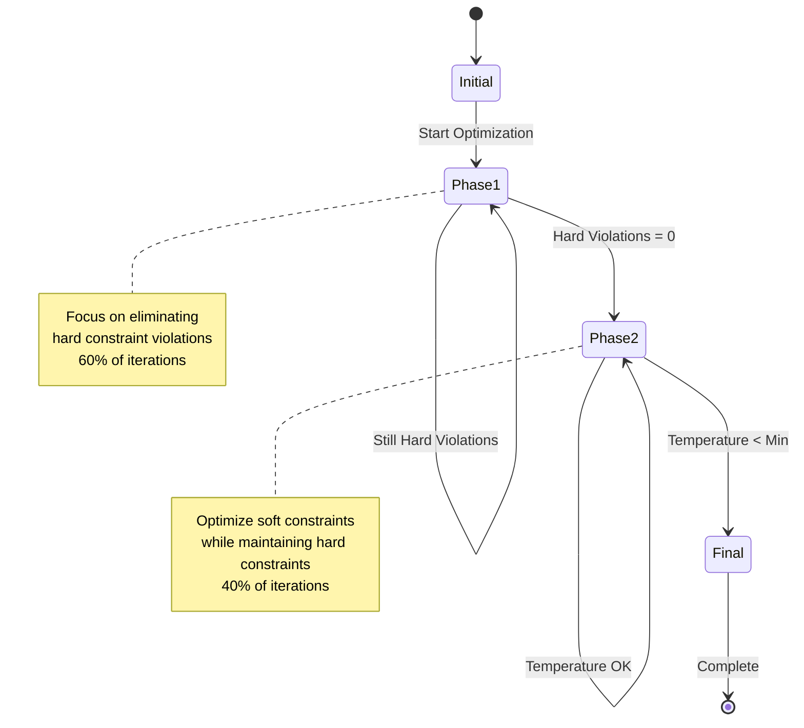

### 5.2 Data Transformation Pipeline

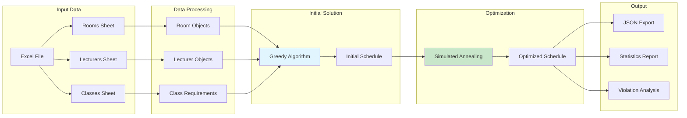

## 6. Time Slot and Room Management

### 6.1 Time Slot Structure

```mermaid
gantt
    title Weekly Time Slot Structure
    dateFormat HH:mm
    axisFormat %H:%M
    
    section Monday
    Period 1    :08:00, 90m
    Period 2    :09:30, 90m
    Period 3    :11:00, 90m
    Period 4    :13:00, 90m
    Period 5    :14:30, 90m
    Period 6    :16:00, 90m
    
    section Tuesday
    Period 1    :08:00, 90m
    Period 2    :09:30, 90m
    Period 3    :11:00, 90m
    Period 4    :13:00, 90m
    Period 5    :14:30, 90m
    Period 6    :16:00, 90m
    
    section Friday
    Period 1    :08:00, 90m
    Prayer Time  :11:00, 60m
    Period 3    :13:00, 90m
    Prayer Time  :15:00, 60m
    Period 5    :16:00, 90m
```

### 6.2 Room Assignment Logic

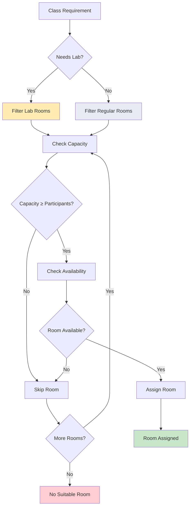

## 7. Performance and Optimization

### 7.1 Performance Bottlenecks

```mermaid
graph TD
    A[Performance Analysis] --> B[State Cloning]
    A --> C[Constraint Evaluation]
    A --> D[Move Generation]
    A --> E[Conflict Detection]
    
    B --> F[JSON.parse/stringify]
    B --> G[Custom Cloning]
    
    C --> H[O(n²) Room Conflicts]
    C --> I[O(n²) Lecturer Conflicts]
    C --> J[O(n) Other Constraints]
    
    D --> K[Random Selection]
    D --> L[Constraint-Aware Selection]
    
    E --> M[Nested Loops]
    E --> N[Hash-based Lookup]
    
    style F fill:#ffcdd2
    style G fill:#c8e6c9
    style H fill:#ffcdd2
    style I fill:#ffcdd2
    style M fill:#ffcdd2
    style N fill:#c8e6c9
```

### 7.2 Optimization Strategies

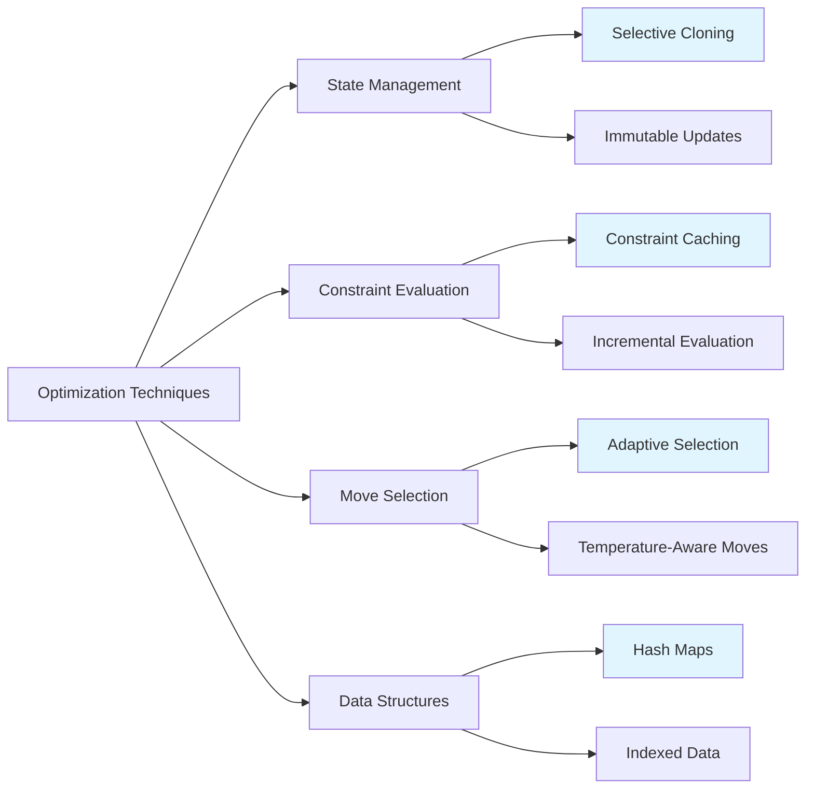

## 8. Error Handling and Recovery

### 8.1 Error Handling Flow

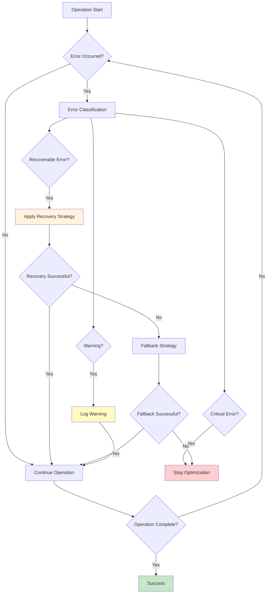

### 8.2 Reheating Mechanism

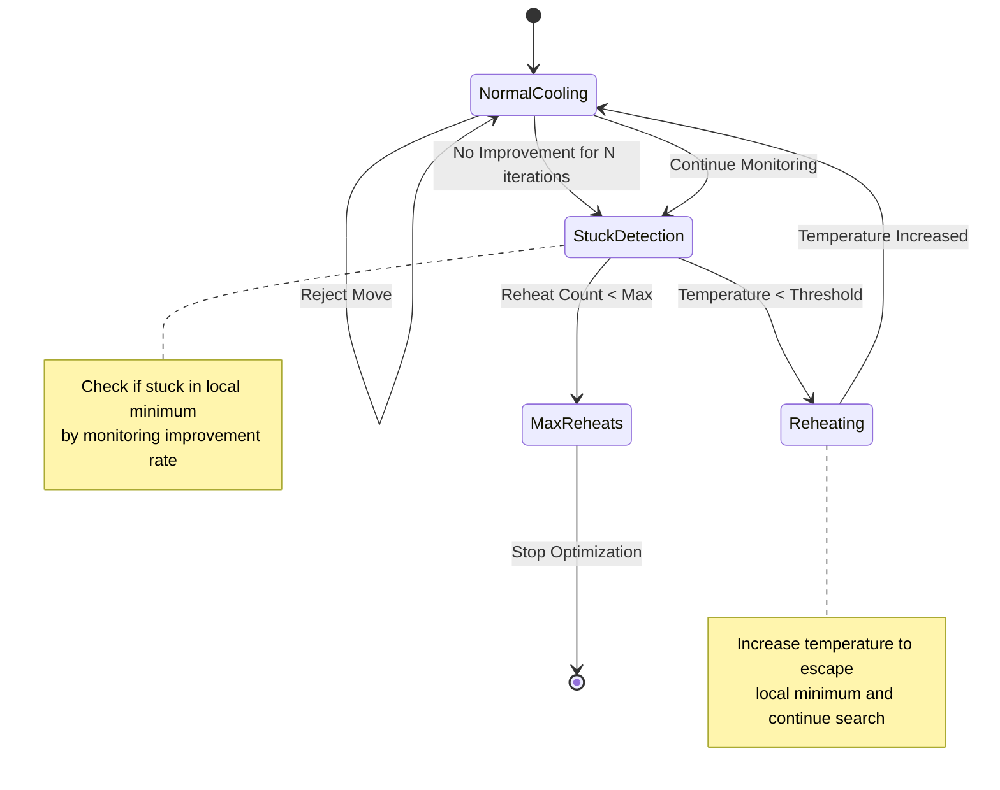

## 9. Integration and Deployment

### 9.1 System Integration

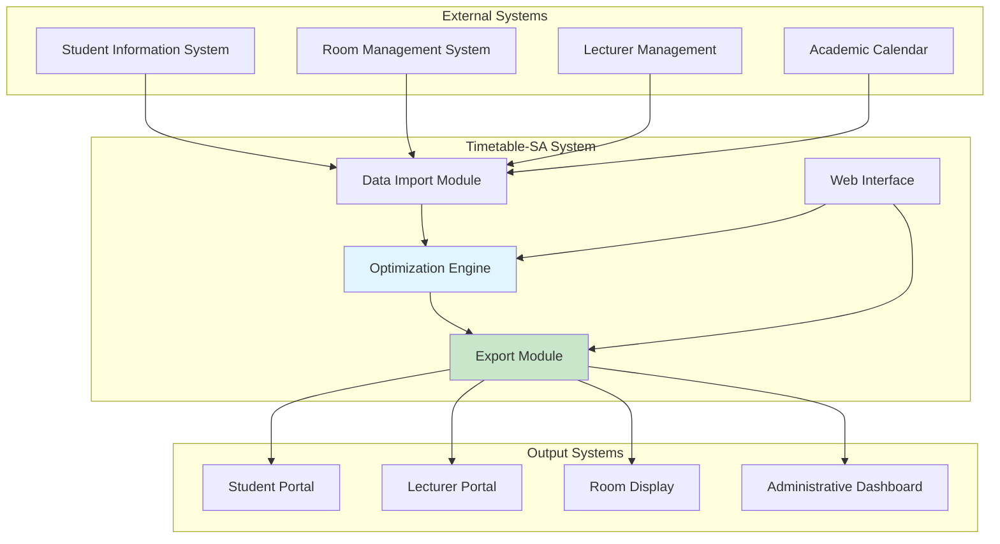

### 9.2 Deployment Architecture

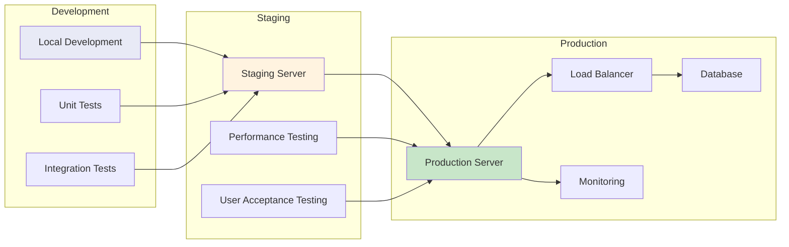

## 10. Monitoring and Analytics

### 10.1 Performance Metrics

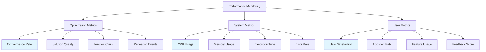

### 10.2 Analytics Dashboard

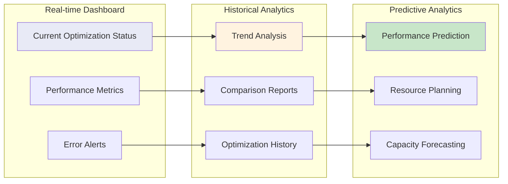

Visualisasi dan diagram ini memberikan pemahaman visual yang komprehensif tentang bagaimana Timetable-SA package bekerja, dari arsitektur tingkat tinggi hingga detail implementasi spesifik. Diagram-diagram ini membantu dalam memahami alur data, interaksi komponen, dan strategi optimasi yang digunakan dalam sistem.